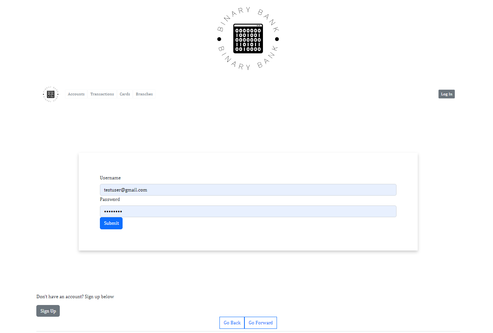
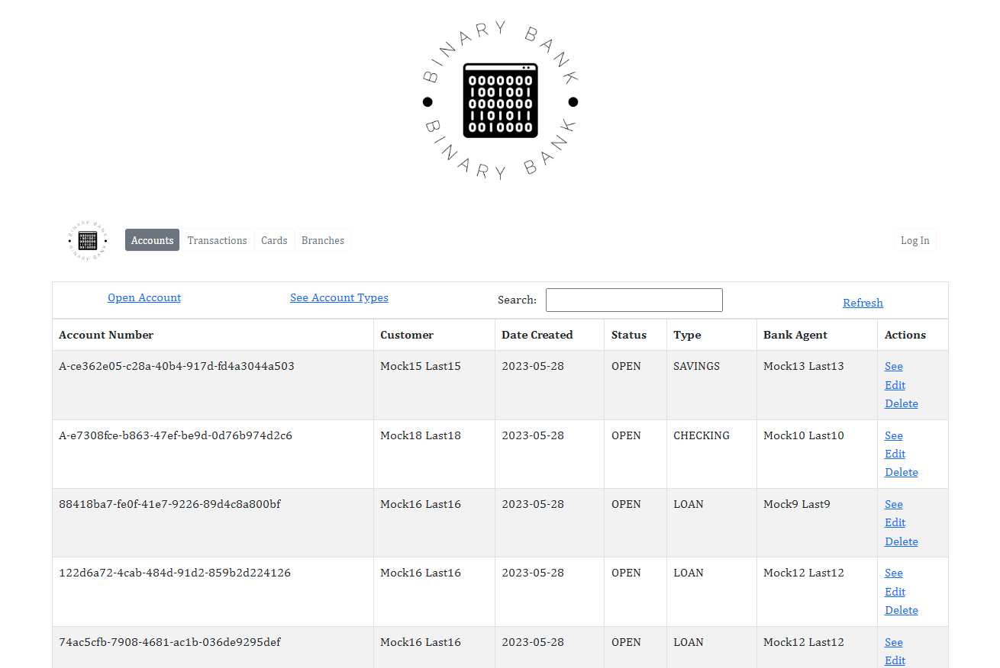
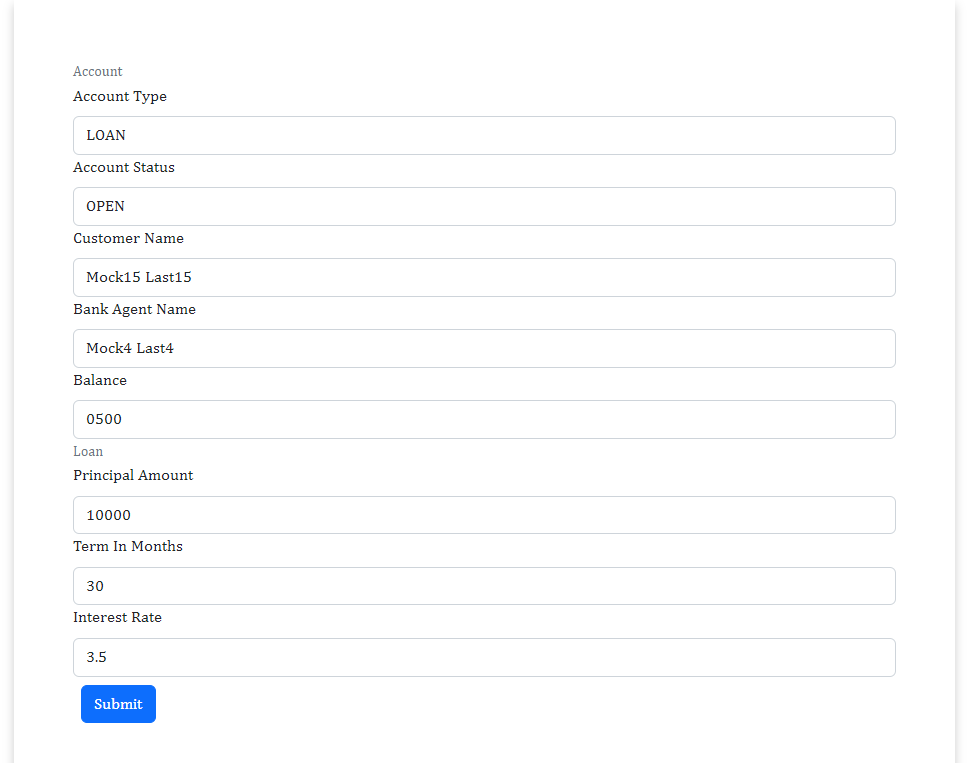
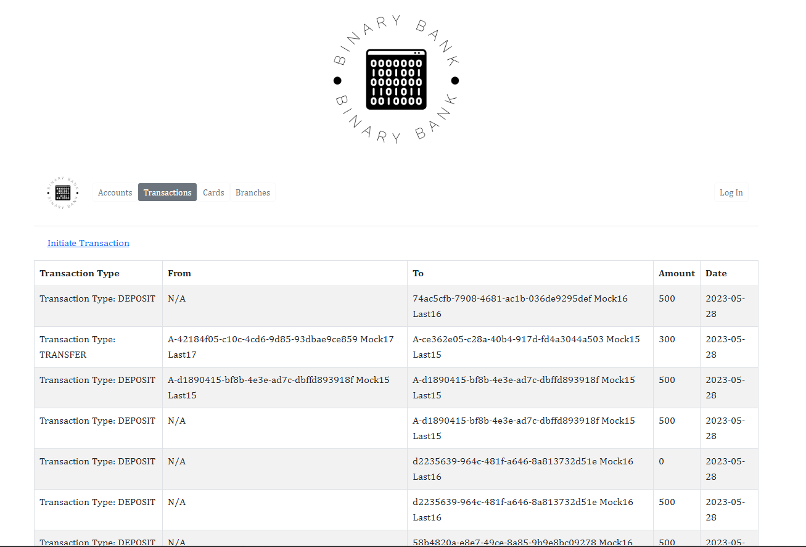
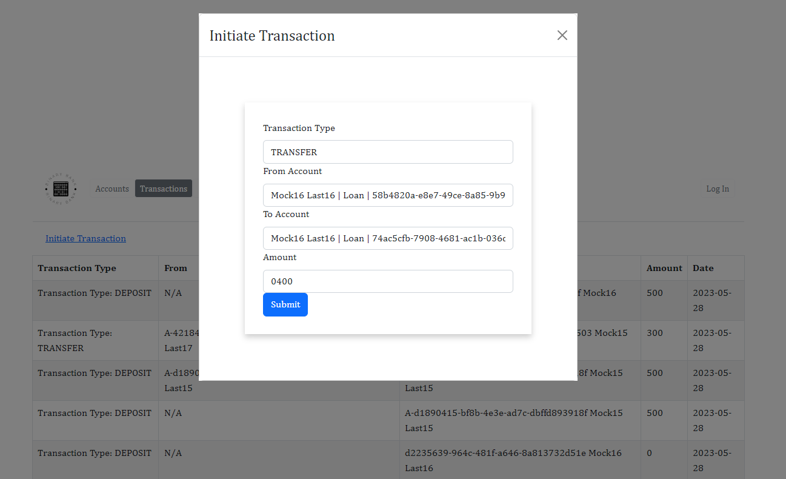
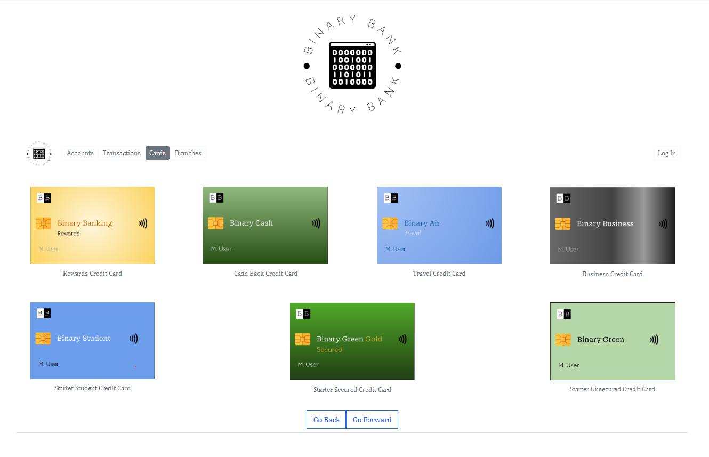

# Bank App

This is a React app that serves as the front end for a bank application built with Spring Boot. It showcases features such as authentication via JWT tokens, account management, transaction management, and offers several loans and credit cards.

## Features

- **Authentication**: Users can securely log in to their accounts using JWT tokens. (Under construction)
- **Account Management**: Users can view their account details and manage their personal information.
- **Transaction Management**: Users can view their transaction history and make new transactions.
- **Loans and Credit Cards**: Users can view and apply for various loans and credit cards offered by the bank.

## Disclaimer

This app is for demonstration purposes only. All data and transactions are fake.

## Getting Started

To run this app locally, follow these steps:

1. Clone this repository
2. Install dependencies with `npm install`
3. Start the app with `npm start`

The app will be available at `http://localhost:3000`.

## Contributing

Contributions are welcome! Please open an issue or submit a pull request if you have any suggestions or improvements.

## Screenshots

Here are some screenshots of the app:

 
*Login Page* 

*Account Management*

*Transaction History*

